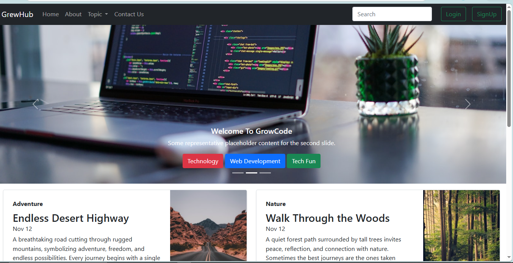
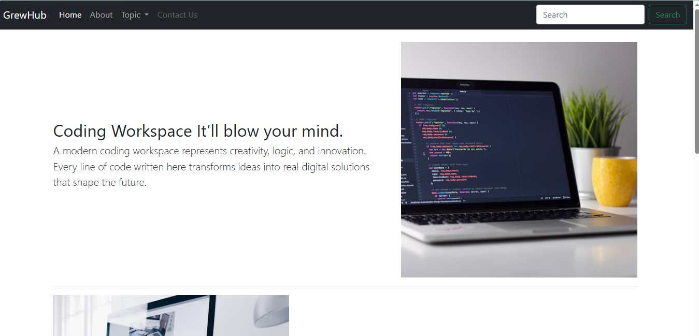
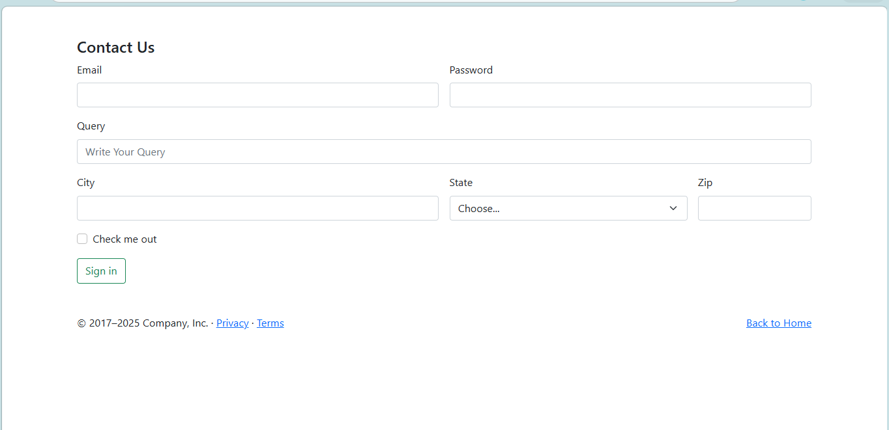

# 🌐 GrewHub – Bootstrap Multi-Page Website

GrewHub is a modern and responsive multi-page website built using **Bootstrap 5**, HTML, and CSS.  
This project includes a homepage with a carousel, blog-style content sections, an About section, a Contact form, and Login/Signup modals.

---

## 🚀 Features

- 🏠 Responsive Navigation Bar
- 🎞️ Bootstrap Carousel (Hero Section)
- 📰 Blog / Content Cards Section
- 📄 About Page Section
- 📞 Contact Form with Validation
- 🔐 Login & Signup Modal (Bootstrap Modal)
- 🔎 Search Bar in Navbar
- 📱 Fully Responsive Layout
- 🎨 Clean UI Design using Bootstrap Components

---

## 🛠️ Tech Stack

- HTML5
- CSS3
- Bootstrap 5
- Bootstrap Modal
- Bootstrap Grid System
- Bootstrap Forms & Buttons

---

## 📂 Project Structure

GrewHub/
│── index.html  
│── about.html  
│── contact.html  
│── style.css  
│── images/

---

## 🎨 Main Sections

### 🔹 Navbar

- Brand Logo (GrewHub)
- Home, About, Topics, Contact Links
- Search Bar
- Login & Signup Buttons (Modal Based)

### 🔹 Hero Section

- Bootstrap Carousel Slider
- Category Buttons (Technology, Web Development, Tech Fun)

### 🔹 Blog Section

- Image-based content cards
- Title, date, and description layout
- Responsive grid system

### 🔹 About Section

- Modern workspace theme
- Text & image alignment using Bootstrap grid

### 🔹 Contact Section

- Email & Password fields
- Query textarea
- City, State, Zip fields
- Submit button
- Footer with Privacy & Terms links

### 🔹 Authentication Modals

- Login Modal
- Signup Modal
- Bootstrap-based popup design

---

## 💡 Key Bootstrap Concepts Used

- Navbar Component
- Carousel Component
- Modal Component
- Grid System (row & col)
- Form Controls
- Buttons & Utilities
- Responsive Classes

---

## 🧠 What I Learned

- Building responsive layouts using Bootstrap
- Using Bootstrap components effectively
- Creating multi-page website structure
- Implementing modal-based authentication UI
- Designing professional UI with minimal CSS
- Structuring scalable frontend projects

---

## 🔮 Future Improvements

- 🔐 Add backend authentication
- 🗂️ Connect contact form to database
- 🌙 Add dark mode
- 📝 Add dynamic blog system
- 🚀 Deploy live version

---

## 📸 Screenshots

---

## ⚠️ Disclaimer

This project is created for educational and practice purposes only.

---

## 👨‍💻 Author

**Harshit Vishwakarma**  
B.Tech Student | Frontend Developer 🚀

---

⭐ If you like this project, don’t forget to give it a star!
